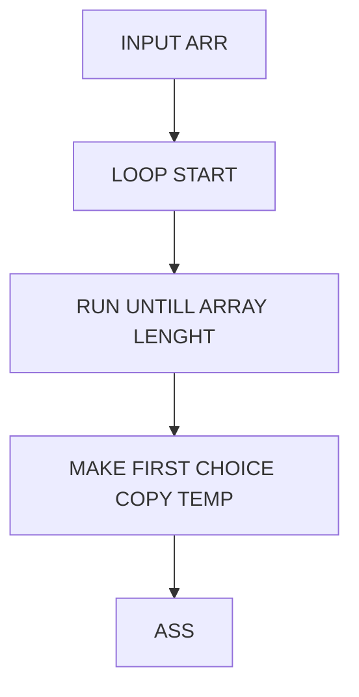

<h3>Hvad er poiten?</h3>
Vi vil gerne have vores HUGO site op på github, mest for os selv sådan vi kan få en fuld kopi af vores kildekode hvad end der sker - MEN, vi kunne også tænke os en live version af siden, en statisk version af samme hjemmeside. Til det kan vi bruge GITHUB pages, gratis hosting af html filer fra Github til et domaine. Siden Hele vores HUGO server / side er en generator og en server i sig selv, kan vi ikke blot uploade den til GITHUB pages (eftersom den kun fatter html og css (og ikke kan køre en server))

<h3>Hvordan fungere det?</h3>
Vi har en lang talrække, som vi så først og fremmest checker de to første tal, at hvis nummer et er større end nummer to, så skal de skifte plads. Det sker som vist nedenunder hvordan. Først tager vi en kopi af 5, så værdien ikke går tabt, hvorefter vi kopiere plads nummer 2’s værdi og sætter den ind i stedet for 5. Så nu står der altså 2 - 2 i rækken. Den kopierede værdi (5) sætter vi så ind på nummer to’s plads. så nu står der altså 2 - 5. På den måde fortsætter vi ned af rækken, og til sidst ender vi med det højeste tal i bunden, hvorefter det hele kører igen (med den sidste udelukket).

<h3>Kode</h3>

SE LIVE DEMO [HER](http://localhost:1313/ALGORITHMS/p5-sorting/ "TRYK")



