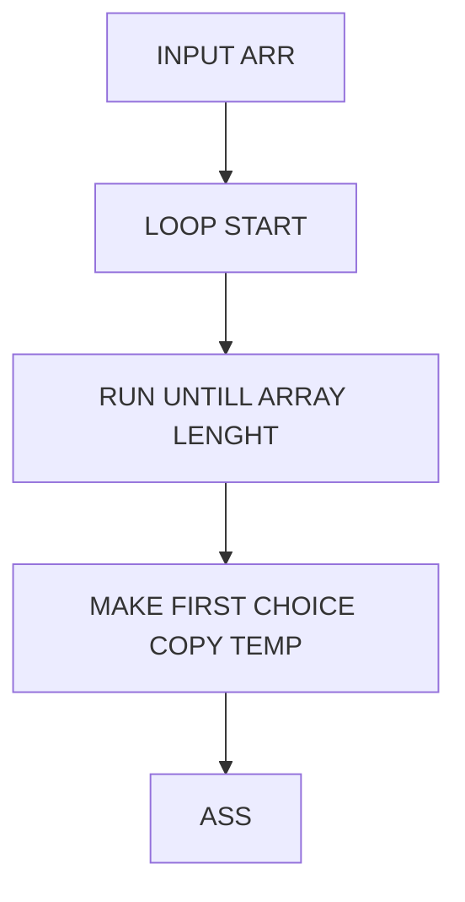

<h3>Hvad er poiten?</h3>
Poiten er altså at vi bruger GITHUB pages for at folk skal kunne se vores hjemmeside (uden vi betaler), hurtigt, nemt, og fra overalt.

<h3>Hvordan fungere det?</h3>
Vi vil gerne have vores HUGO site op på github, mest for os selv sådan vi kan få en fuld kopi af vores kildekode hvad end der sker - MEN, vi kunne også tænke os en live version af siden, en statisk version af samme hjemmeside. Til det kan vi bruge GITHUB pages, gratis hosting af html filer fra Github til et domaine. Siden Hele vores HUGO server / side er en generator og en server i sig selv, kan vi ikke blot uploade den til GITHUB pages (eftersom den kun fatter html og css (og ikke kan køre en server)).

<h3>Kode</h3>

SE LIVE DEMO [HER](content/algorithms/P5-sorting/ "TRYK")



