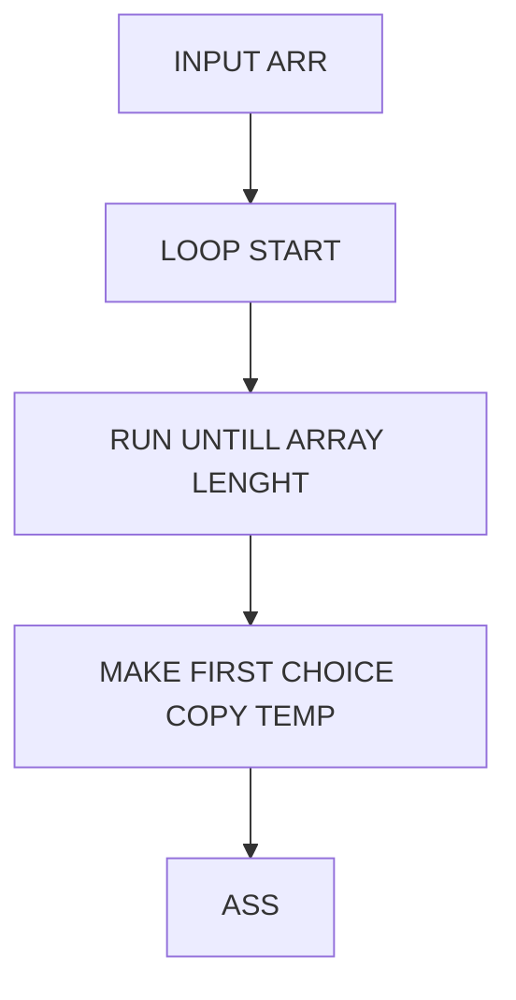

Shuffle array.
Her ser vi et flowchart over hvad min kode gør, først og fremmest har vi hele funktionen (Handlingen) i et loop indtil at vores tæller har talt op til rækkens længde (Den plusser en til hver runde). Herefter tager min kode det sidste nummer i rækken, og gemmer det til side, vi kan kalde det L (det bliver et tal mindre efter hver runde), efter det regner den et tilfældigt tal sammen mellem vores rækkes laveste til højeste. Efter det er gjort sætter vi det nye tilfældige tal ind på L’s plads.

Sorteringsalgoritme.
Vi har en lang talrække, som vi så først og fremmest checker de to første tal, at hvis nummer et er større end nummer to, så skal de skifte plads. Det sker som vist nedenunder hvordan. Først tager vi en kopi af 5, så værdien ikke går tabt, hvorefter vi kopiere plads nummer 2’s værdi og sætter den ind i stedet for 5. Så nu står der altså 2 - 2 i rækken. Den kopierede værdi (5) sætter vi så ind på nummer to’s plads. så nu står der altså 2 - 5. På den måde fortsætter vi ned af rækken, og til sidst ender vi med det højeste tal i bunden, hvorefter det hele kører igen (med den sidste udelukket).

<h3>Kode</h3>

SE LIVE DEMO [HER](http://localhost:1313/ALGORITHMS/p5-sorting/ "TRYK")



